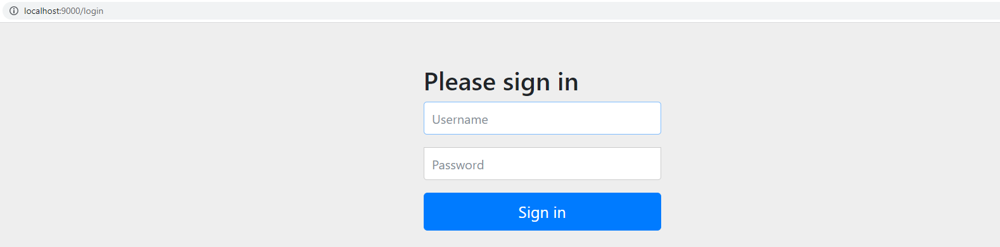
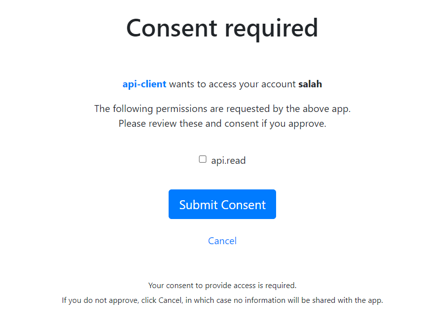
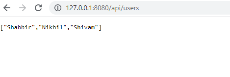

# Spring-Security-Oauth2-Tutorial

1) Request to http://127.0.0.1:8080/api/users
2) This request is intercepted by client (HelloController)
3) Client will call Ressource server (http://127.0.0.1:8090/api/users) by (WebClient)
4) It will be redirected to http://localhost:9000/login.

5) After successful authentication, it will be redirected to authorization server :
http://localhost:9000/oauth2/authorize?response_type=code&client_id=api-client&scope=api.read&state=V3pstWmY8qT_NwW3XHjN7CBBuWJidHm_5cZYG8cGh90%3D&redirect_uri=http://127.0.0.1:8080/authorized

6) Finally, if the ressource owner givs access to client we will be redirected to  http://127.0.0.1:8080/api/users.

# OIDC flow

oidc flow:
http://localhost:8080/api/hello

=> http://localhost:8080/oauth2/authorization/api-client-oidc

=> http://localhost:9000/oauth2/authorize?response_type=code&client_id=api-client&scope=openid&state=eMlqrai2ZnlsLzFIlB1nCjIfvt2sNYSbeZfUSdeCCBU%3D&redirect_uri=http://127.0.0.1:8080/login/oauth2/code/api-client-oidc&nonce=HNRcADAbprr4Mq7u-gPuVgax_k-5Hr3AiJs5_5a1gVU

=> http://localhost:9000/login

enter login + password

http://localhost:9000/login (302)

=> http://localhost:9000/oauth2/authorize?response_type=code&client_id=api-client&scope=openid&state=D1o5sGQFt1n9J0qa2DH9Zwtj3741s-fFNE6K8tk9jBA%3D&redirect_uri=http://127.0.0.1:8080/login/oauth2/code/api-client-oidc&nonce=bXw-_S-vWKX3U3l9UCo9D1b9NhMy2FPlf38ulTrL8YU

=> http://127.0.0.1:8080/login/oauth2/code/api-client-oidc?code=cpWh8BsBgfPH_94TTjOscy5m7nO9WTn_WyKhmiABdxSwOgLO6RnnSSIBjBYK8c0p3OyOVl6BBRaI_SgXwpamDvP_EouMP63ghLzRyjr9piXelpippS-NauHPoDMpWyjd&state=D1o5sGQFt1n9J0qa2DH9Zwtj3741s-fFNE6K8tk9jBA%3D

=> http://127.0.0.1:8080/api/hello (200)

# OAUTH2 flow:

http://127.0.0.1:8080/api/users

=> http://localhost:9000/oauth2/authorize?response_type=code&client_id=api-client&scope=api.read&state=GuYvrPqP5M4uKJoJVcaaEGRW2Nj1nb-liNscNZV6mFI%3D&redirect_uri=http://127.0.0.1:8080/authorized

=> http://localhost:9000/oauth2/authorize

=> http://127.0.0.1:8080/authorized?code=Y9e6_DoAK31aFe0SXGQXt9ztwkkEUayAqjfW_mVwoZq4K_dU5I0EvgppyWvW0JZvQJrYwNX5QrtqrD9Rccu4JSfC-jNPD8o5pWBJ2tUy5R7W4NMDzAfRevVOMjZmcMHk&state=GuYvrPqP5M4uKJoJVcaaEGRW2Nj1nb-liNscNZV6mFI%3D

=> http://127.0.0.1:8080/api/users (200)