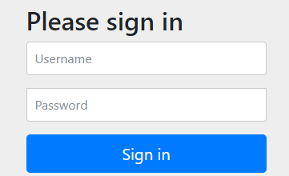

# Spring-Security-Oauth2-Tutorial

1) Request to http://127.0.0.1:8080/api/users
2) This request is intercepted by client (HelloController)
3) Client will call Ressource server (http://127.0.0.1:8090/api/users) by (WebClient)
4) It will be redirected to http://localhost:9000/login.

5) After successful authentication, it will be redirected to authorization server :
http://localhost:9000/oauth2/authorize?response_type=code&client_id=api-client&scope=api.read&state=V3pstWmY8qT_NwW3XHjN7CBBuWJidHm_5cZYG8cGh90%3D&redirect_uri=http://127.0.0.1:8080/authorized

6) Finally, if the ressource owner givs access to client we will be redirected to  http://127.0.0.1:8080/api/users.